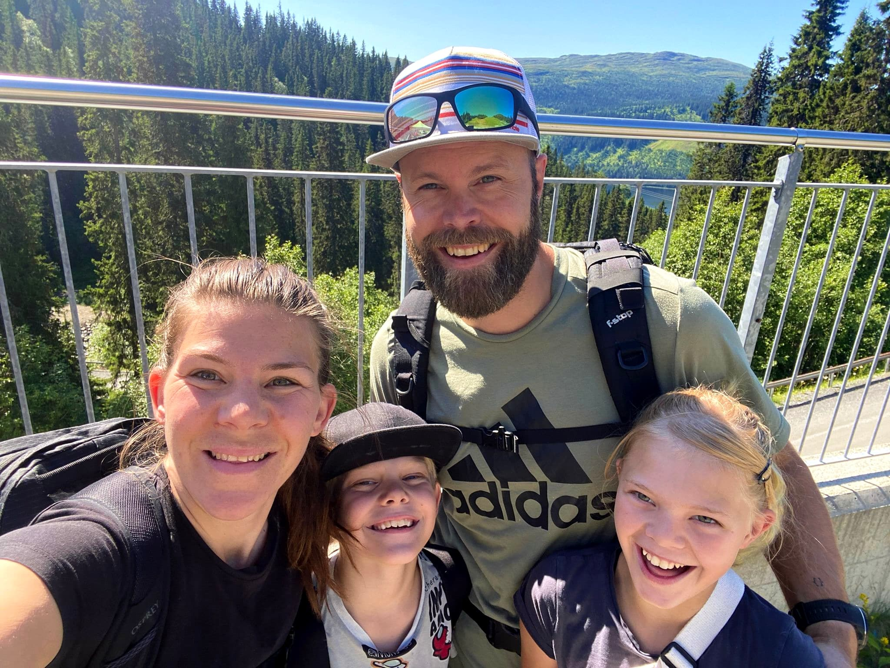
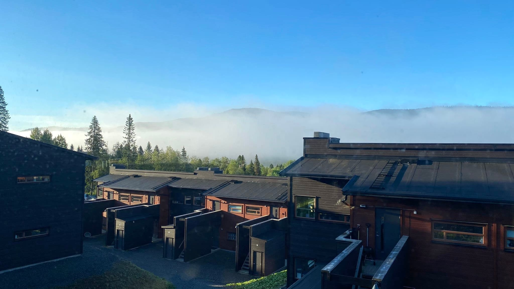

import { Image } from "astro:assets";

En vecka har nu gått sen vi sladdade in med fullastad pickup med tillhörande släp i Tegefjäll efter dryga 14 timmar på vägarna. Förberedelserna och själva resan i sig förtjänar ett eget inlägg men jag är bara så sjukt stolt och glad att vi äntligen är här och vi har överlevt första veckan. Den har bjudit på allt och lite till men jag vill bara börja med ett par små saker som jag kommit att inse.

<figure data-lightbox="true">
    
    <figcaption>Försväntansfulla.</figcaption>
</figure>

 
Notes to self:
 
Nummer ett - Använd inte ankelstrumpor! Köttätande myggor och knott kommer inte bara fram i skymningen, nej då. Dom är framme
HELA tiden. Bevis på det finns bla genom ett band av bett som blivit köttsår runt hela min högra ankel. Kliar skitgött. Speciellt
när man ska sova. Elliots kropp är inte heller skonad från de små monstrena och ser ut som den varit på någon form av slagfält.
Blodfläckarna på lakanen i sängen vittnar om hans hemska öde. Men han är bättre än sin mamma när det kommer till att inte
klaga på kliandet. Kudos till honom!

<figure data-lightbox="true">
    
    <figcaption>Första morgonen i vårt nya hem.</figcaption>
</figure>

 
Nummer två - Sluta spendera pengar som om du vore något annat än en fattig student.
 
Alla vet ju att det kostar att flytta men eftersom vi hyr en fullt möblerad lägenhet hade jag ändå någonstans trott att det
inte var så mycket vi behövde fixa. Men, lever man med en man som inte nöjer sig med hur det är utan hela tiden letar efter
bättre och smartare lösningar så kan man räkna med en och annan utgift. (Sen blir det ju jävligt bra också men det är inte
bra för hans ego om jag erkänner det alltför ofta.) Men jag ska inte bara skylla på honom och/eller lägenheten. Blir man
välkomnad av Åre med strålande sol, 25 grader varmt och en allmänt dundertrevlig stämning så gäller det att passa på att
njuta. En öl och glass på Fjällgården efter några timmar vandring upp till Totthummeln är ju givet. En svingo burgare i kvällssolen
på Broken lika självklart. Två begagnade downhill-cyklar till mamman och pappan - kanske inte lika självklart med tanke på
priset. Fast om man istället tänker på hur jäkla roligt barnen tyckte att det var att cykla i Björnen så känns det ändå helt
rimligt att vi också ska ha varsin istället för att hålla på och hyra. Och dom var ju faktiskt begagnade. Och man ska unna
sig.
 
Så med tomt konto och fullt hjärta är vi redo för det här äventyret!
