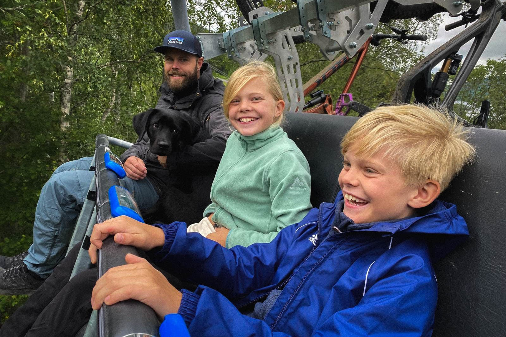
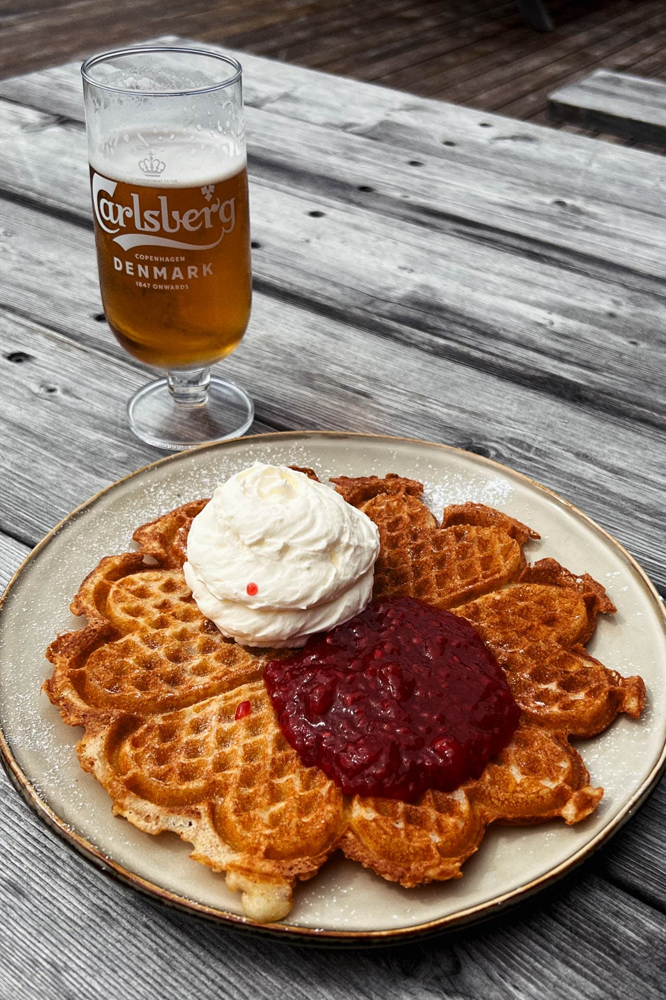
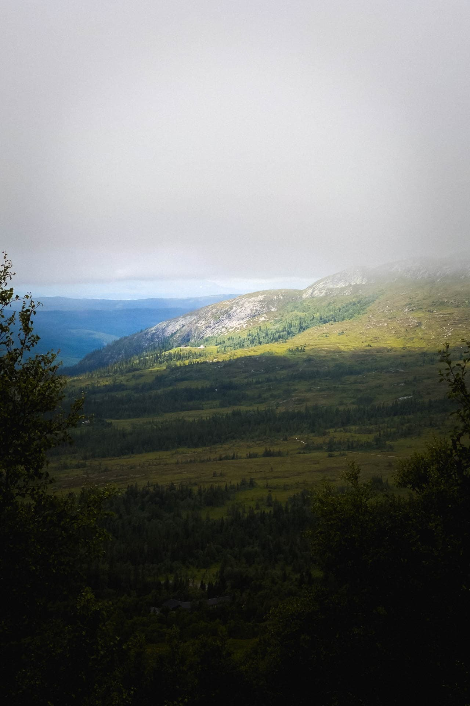
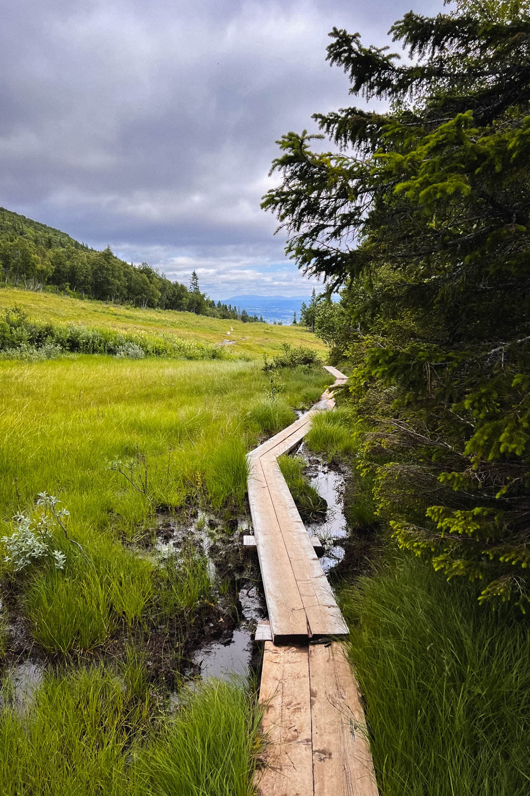

import { Image } from "astro:assets";

Efter ett par dagar med rätt taskigt väder, men som visserligen var välbehövliga för att vi skulle komma ikapp med lite saker här hemma, var vi taggade på att ta oss ut igen. Jag hade fått nys om ett ställe som skulle vara fint och relativt lättillgängligt (= inte så himla brant och tungt) - Buustamon Fjällgård. Enda haken var att leden som gick fram och tillbaka till gården var ca 1 mil. Men de skulle servera våfflor så saken var ganska snabbt avgjord hemma under morgonens familjemöte. Att vi kunde åka lift upp första biten och dessutom låta Lote göra sitt premiäråk hjälpte till lite ytterligare. Om det gick bra? OM det gick bra! Han löste det like a champ som vanligt. Vår lilla pälskling.

<figure data-lightbox="true">
    
    <figcaption>Premäråk i liften.</figcaption>
</figure>

Förmiddagen och de första kilometrarna bjöd på moln och rätt mycket blåst men lagom tills att vi tog oss ner till Buustamon sprack molntäcket upp och solen kom fram. Njutet! Vi satt på terassen och åt varsin välförtjänt våffla samtidigt som strumporna hände på tork under bordet.

<figure data-lightbox="true">
    
    <figcaption>Välförtjänt lunch på Buustamon.</figcaption>
</figure>

Vi håller som sagt på att lära oss hur saker och ting går till här uppe och något som vi lärde oss den här dagen var att det är BLÖTT på fjället när det regnat i två dagar. No shit tänker du kanske. Men, vissa leder och stigar är jättefina och torra medans andra not so much. Sen hjälpte det kanske inte skitmycket att barnen mest sprang utanför stigarna i det blöta gräset. Eller att Elliot bestämde att vi skulle ta en ”genväg” nerför en skidbacke för att det var ”närmaste vägen till våfflorna, mamma!” Men jag som dagen innan hade investerat i mina första vandringsdojor någonsin var både nöjd och torr. Inte en tillstymmelse till skoskav och med kruttorra fötter anser jag ändå att det var en succé efter 4 timmar på fjället i sprajlans nya skor.

<figure data-lightbox="true">
    
    <figcaption>De låga molnen gjorde utsikten spännande.</figcaption>
</figure>

 
På vägen tillbaka upplevde vi både naturens lugn när vi fick Sound of Music-vibbar och lite senare kom pirret i magen när
vi pratade om vilka av alla cykelleder vi gick förbi som vi ska prova så fort min cykel är redo.

<figure data-lightbox="true">
    
    <figcaption>Gå på spång är alltid roligt.</figcaption>
</figure>

Vi tog Stjärnliften upp som ligger lite väster om Åre by centrum och följde led 210 förbi Buustamon Fjällgård som ligger i Ullådalen. På vintern hämtas gästerna i bandvagn för att man överhuvudtaget ska kunna komma upp till gården så nu måste vi tydligen testa det också.

 
So long!
